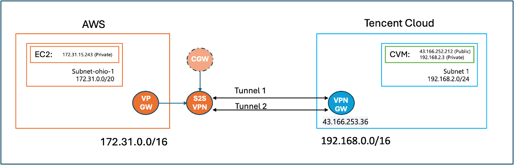
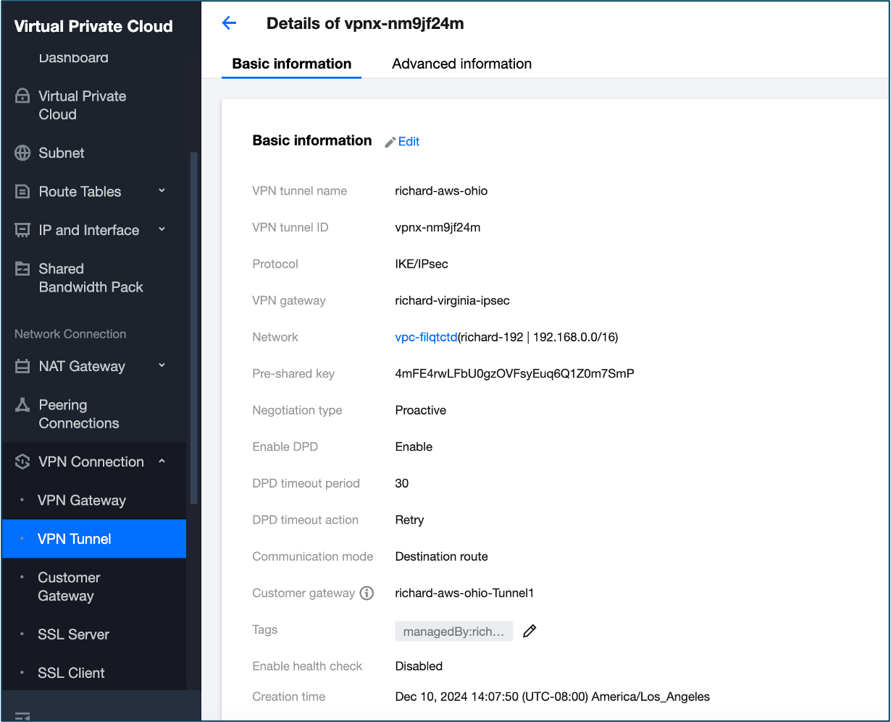
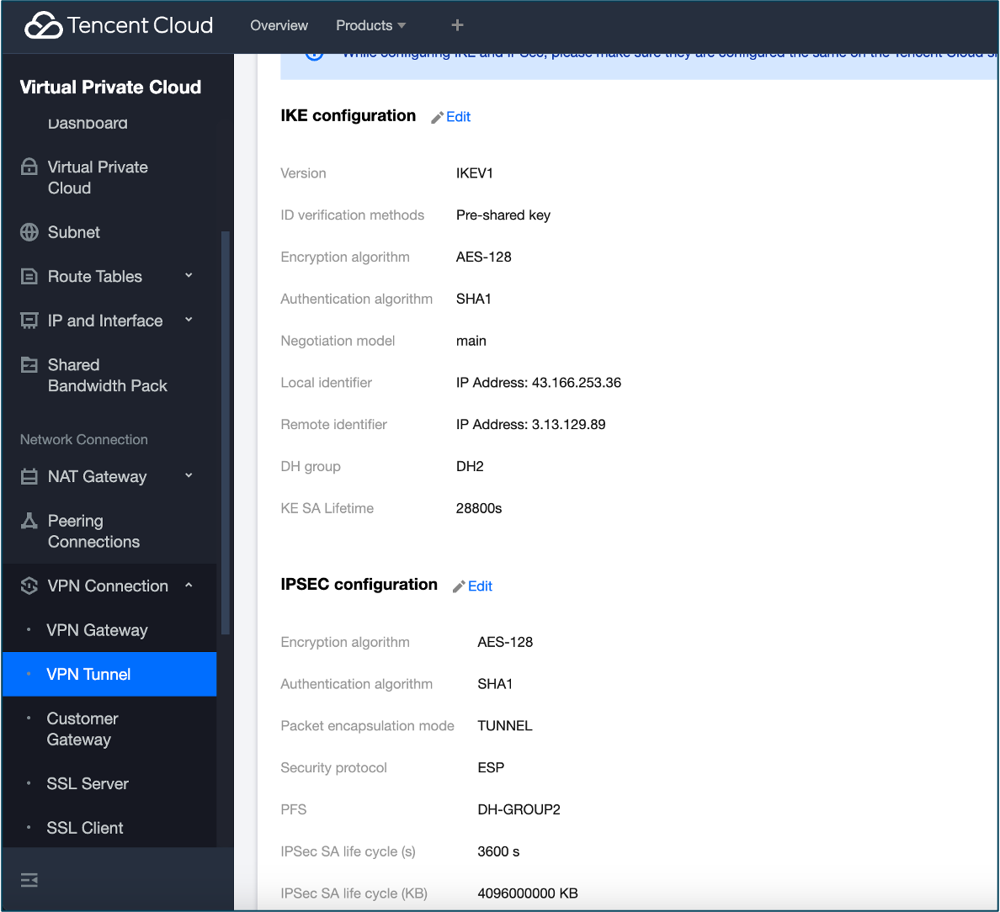
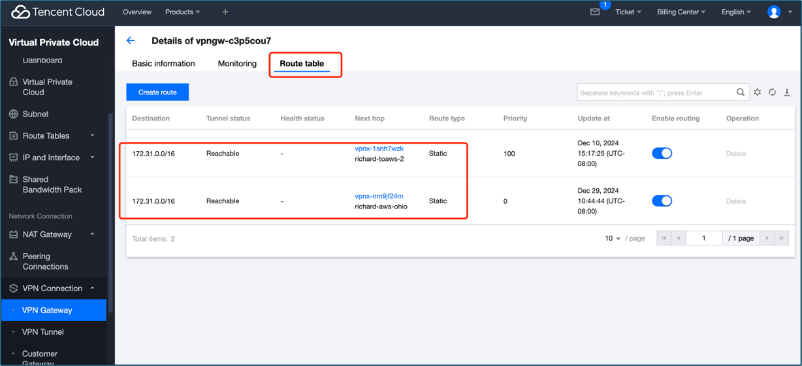
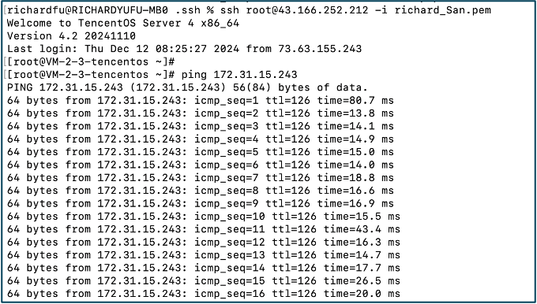

# Establishing a VPN Connection Between Tencent Cloud and AWS

This guide walks you through the steps to create a secure VPN connection between Tencent Cloud and Amazon Web Services (AWS). The connection will allow private communication between resources hosted in both clouds.

## Prerequisites

Before proceeding, ensure you have the following:

- **Tencent Cloud Account** with necessary permissions (Admin/Network Administrator)
- **AWS Account** with access to VPN configuration
- Basic knowledge of **Tencent Cloud VPC** and **AWS VPC**
- Access to the **Tencent Cloud Console** and **AWS Management Console**
- Administrative privileges to configure the VPN on both sides

## Overview of VPN Architecture

In this section, we will describe the high-level architecture for connecting Tencent Cloud and AWS using a VPN tunnel.

- **VPC in Tencent Cloud** and **VPC in AWS** that will communicate via a VPN tunnel.
- It's a site-to-site vpn which will allow the servers in both side vpcs to see each other.
- The VPN tunnel will be established over the internet using IKEv2/IPsec protocols.
- There'll be two vpn tunnels to achieve HA.

## Step 1: Setting Up the VPN Gateway in Tencent Cloud

### 1.1 Create a Virtual Private Cloud (VPC)

1. Log in to the **Tencent Cloud Console**.
2. Navigate to **VPC** and click on **Create VPC**.
3. Configure your VPC with appropriate CIDR blocks(192.168.0.0/16), subnet(192.168.2.0/24)

### 1.2 Create the VPN Gateway in Tencent Cloud

1. Go to **Network > VPN** in the Tencent Cloud Console.
2. Click **Create VPN Gateway** and choose IPSec as the protocal.
3. After creation, you can get the gateway IP.

## Step 2: Setting Up the VPN in AWS

### 2.1 Create a Virtual Private Cloud (VPC)

1. Log in to the **AWS Management Console**.
2. Navigate to **VPC** and click on **Create VPC**.
3. Define your VPC’s CIDR block(172.31.0.0/16), subnet(172.31.0.0/20).

### 2.2 Create a Virtual Private Gateway (VGW)

1. Navigate to **VPC > Virtual Private Gateways**.
2. Click **Create Virtual Private Gateway**.
3. Attach the Virtual Private Gateway to your AWS VPC.

### 2.3 Configure the Customer Gateway (CGW) in AWS

1. In the **VPC Console**, create a new **Customer Gateway** for the Tencent Cloud VPN GW created in Step 1.
2. Provide the public IP address of the VPN endpoint (this is the gateway IP in 1.2).

### 2.4 Create the VPN Connection in AWS

1. Go to **VPC > Site-to-Site VPN Connections**.
2. Click **Create VPN Connection** and select the Virtual Private Gateway and Customer Gateway. Routing options as Static, local CIDR 192.168.0.0/16, remote CIDR 172.31.0.0/16. Leave Tunnel1 and Tunnel2 options blank as default.
3. After the creation. Add static routes 
4. Download the **VPN Configuration** file, which contains the details needed for configuring the Tencent Cloud side.

## Step 3: Create VPN Tunnel in Tencent Cloud

### 3.1 Create Tunnel 1

1. Go to **VPC > Network > VPN Tunnel** in the Tencent Cloud Console
2. Click Create
3. Configure the basic and advanced options according to the configuration file download from AWS.  

### 3.2 Create Tunnel 2

1. Repeat the steps to create Tunnel 2 

### 3.3 Configure routings in VPN Gateway

1. Go to **VPC > Network > VPN Gateway**
2. Choose the VPN Gateway created in step 1.2
3. Go to Route Table and configure the routings for two tunnels. The VPN traffic will go to one of the tunnels as configured and go to the other if the first tunnel is down.

## Step 4: Create servers to test the VPN connection

### 4.1 Create CVM from Tencent Cloud console

1. Create CVM inside the subnet 192.168.2.0/24 created in Step 1.1, with public IP
2. Create EC2 inside the subnet 172.31.0.0/20 created in step 2.1
3. SSH to CVM, ping EC2 

## Step 5: HA Test

1. There're two tunnels, and we can see the default tunnel is vpnx-1snh7wzk from 3.3 image. Then we can check the details of this tunnel and we can see the IP address of AWS tunnel.
2. We can turn off this tunnel by disable the default routing shown in 3.3 image, then the traffic will go through the other tunnel.
3. We can monitor the traffic by using the logs and monitoring tools in each side.

## Conclusion

In this guide, we successfully established a VPN connection between Tencent Cloud and AWS, enabling secure communication between the two cloud environments. You can now securely route traffic between your Tencent Cloud VPC and AWS VPC.

For any additional assistance, refer to the official [Tencent Cloud VPN documentation](https://intl.cloud.tencent.com/document/product/1037) and [AWS VPN documentation](https://aws.amazon.com/vpn/).

## References

- [Tencent Cloud VPN Documentation](https://intl.cloud.tencent.com/document/product/1037)
- [AWS VPN Documentation](https://aws.amazon.com/vpn/)